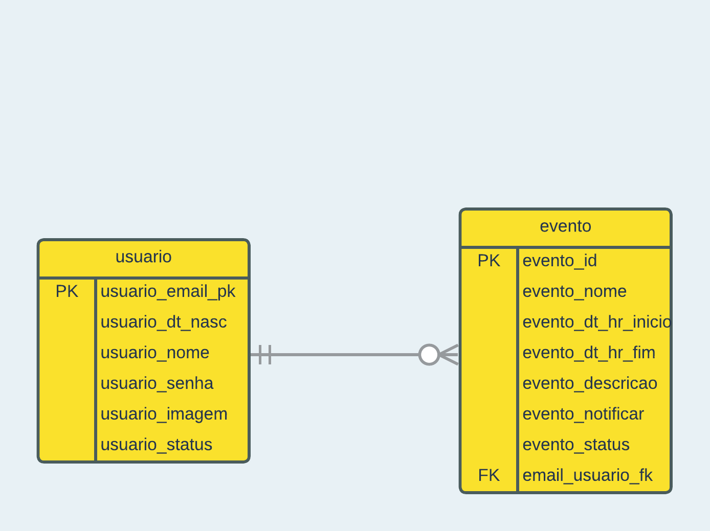

# flask-web-Calendar

## Sobre 📚

Projeto de calendário utilizando Flask + SQLite para composição de nota na disciplina de modelagem e projeto de sistemas

> [Documentação](#documentação-%EF%B8%8F)

## Executando o projeto 🚀

### Pré-requisitos 💻

Antes de começar, você precisa ter instalado no seu computador as ferramentas:

* [Git](https://git-scm.com/)
* [Python](https://www.python.org/)

### Dependências 👨‍💻

> Todas as dependências serão instaladas se você seguir o [guia](#instalando-a-aplicação-)

* [Flask](https://flask.palletsprojects.com/en/2.2.x/)
* [Flask-Bcrypt](https://flask-bcrypt.readthedocs.io/en/1.0.1/)
* [Flask-Login](https://flask-login.readthedocs.io/en/latest/)
* [ponyORM](https://docs.ponyorm.org/firststeps.html)

### Instalando a aplicação 📲

Para instalar a aplicação, siga estas etapas:

#### **Clone o repositório para o seu computador:**

``` bash
# Clone o repositório para o seu computador
$ git clone https://github.com/tmmarquess/flask-web-Calendar.git

# Navegue para a pasta do código
$ cd flask-web-Calendar
```
#### **crie uma virtual env para o projeto: (opcional)**
> É recomendado criar uma venv para instalar as dependências da aplicação
``` bash 
$ venv <nome_da_venv>
```
Caso o comando acima retorne um erro, tente usar:
``` bash
$ python -m venv <nome_da_venv>
```
Ativando a venv:
``` bash
# Ativando venv em shell
$ source <nome_da_venv>/bin/activate

# Ativando venv no windows
$ <nome_da_venv>\Scripts\activate.bat
```
>  Para mais informações sobre venv's, consulte [Python Docs](https://docs.python.org/3/library/venv.html)
#### **Instale as dependências:**
``` bash
# Instalando as dependências do projeto
$ pip install -r requirements.txt
```
Caso o comando acima retorne um erro, tente usar:
``` bash
$ python -m pip install -r requirements.txt
```
#### **Execute a aplicação:**
``` bash
# Executando a aplicação
$ flask run
```
Caso o comando acima retorne um erro, tente usar:
``` bash
# Executando a aplicação
$ python -m flask run
```

## Documentação 🗃️

### Casos de Uso


### Diagrama de Arquitetura


### Diagrama de Implantação


### Modelo Entidade-relacionamento


### System Metaphor


## Como contribuir? 🤔

Para contribuir com o jogo, siga estas etapas:

1. Faça um fork deste repositório.
2. Faça o clone deste fork localmente
3. Faça suas alterações e confirme-as: `git commit -m '<mensagem de commit>'`
4. Envie para o repositório remoto: `git push`
5. Crie a pull request.

Para saber mais sobre como fazer um pull request, consulte a documentação do GitHub em [como criar um pull request](https://help.github.com/pt/github/collaborating-with-issues-and-pull-requests/creating-a-pull-request).

## Dev 🤓

<table>
  <tr>
    <td align="center">
      <a href="#">
        <br>
        <sub>
          <a href="https://github.com/tmmarquess">Thiago Marques</a>
        </sub>
      </a>
    </td>
  </tr>
</table>

## 📝 Licença

Esse projeto está sob a licença `MIT`. Veja o arquivo [LICENÇA](LICENSE) para mais detalhes.

[⬆ Voltar ao topo](#flask-web-Calendar)<br>
